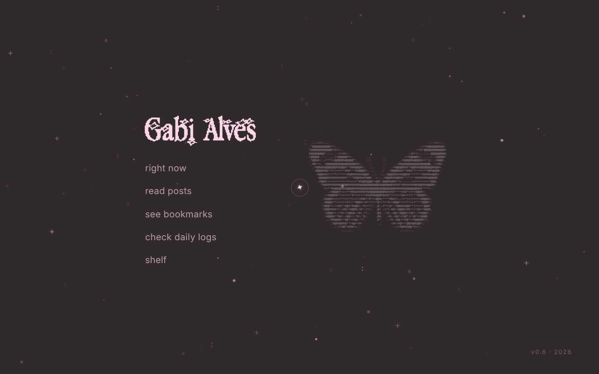
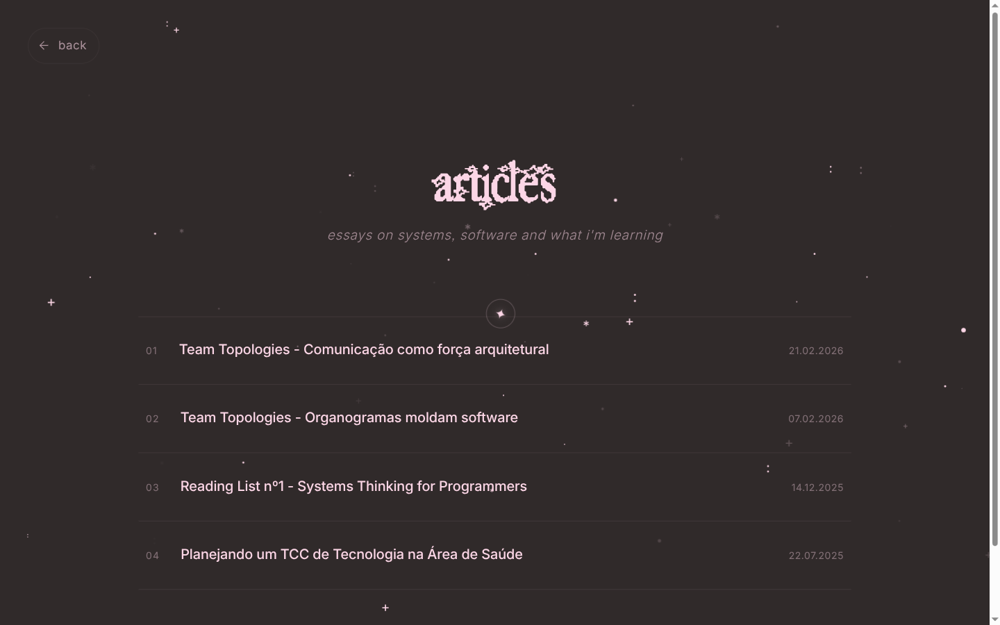
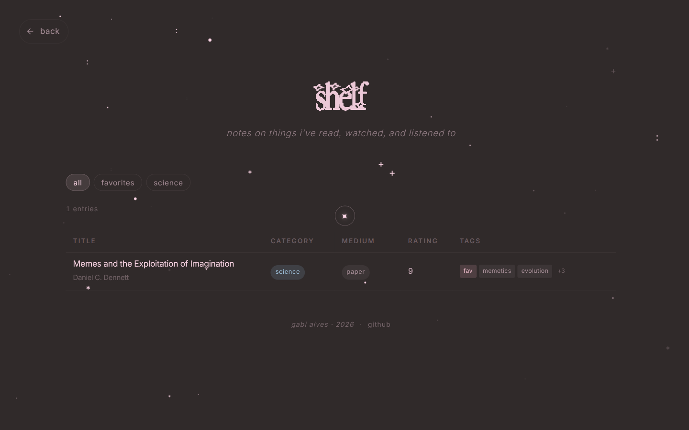
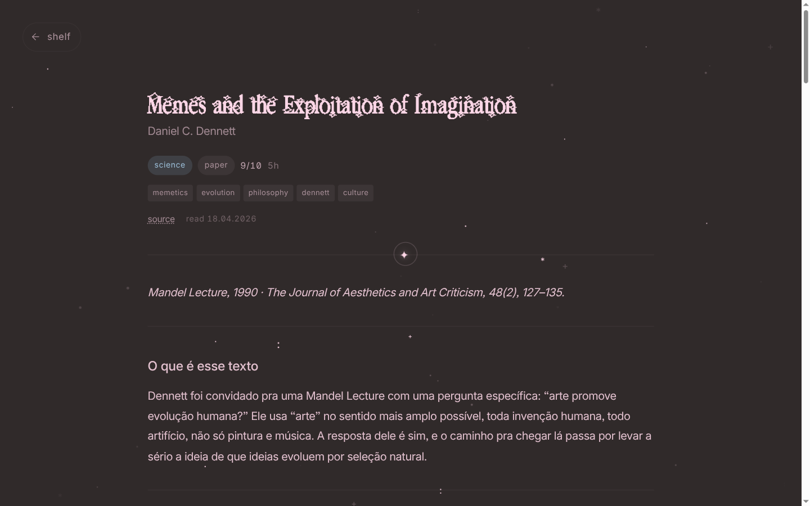
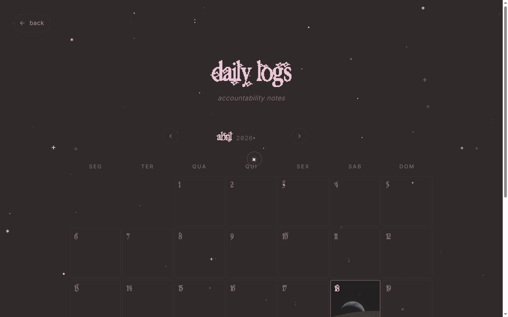

# gabi-alves.com

Personal website and blog. Dark-only, magazine-inspired, built with Astro.



## Pages

**Articles** — essay index with numbered entries, Dreamer display font, stagger animation on load.



**Shelf** — reading notes on books, papers, videos. Table index with category filters, each entry links to a dedicated page with long-form markdown notes.




**Daily Logs** — calendar view with inline month navigation. Days with entries are highlighted; clicking opens a notebook-style modal. Supports photos as cell backgrounds.



**Bookmarks** — curated links grouped by category.

**Now** — what I'm currently doing.

## Design

- Dark palette: `#302A2A` background, `#FCD6E6` text
- Typography: Dreamer (display headings) + Inter (body)
- ASCII butterfly with hover animation on the landing page
- Star parallax background that reacts to cursor movement
- Custom pink star cursor with particle trail
- Motion system following Emil Kowalski's design principles: asymmetric enter/exit timing, `:active scale(0.97)` press feedback, hover gated by `@media(hover:hover)`, stagger delays on lists
- View Transitions between pages (fade)

## Stack

- [Astro](https://astro.build) 5.x
- MDX + KaTeX
- Netlify / Vercel deploy
- No JS framework, vanilla scripts

## Content

Posts live in `src/content/posts/`, shelf entries in `src/content/shelf/`, daily logs in `src/content/daily-logs/`. All use markdown with Zod-validated frontmatter.

```bash
npm install
npm run dev
npm run build
```

## License

MIT
